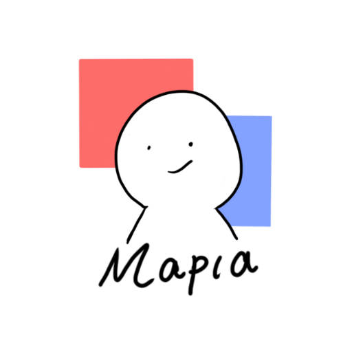
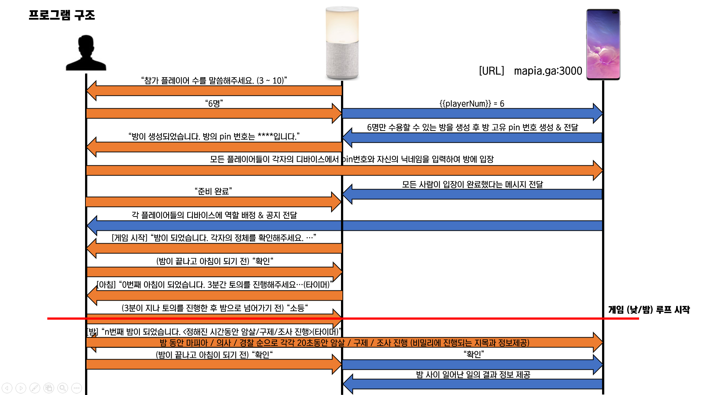
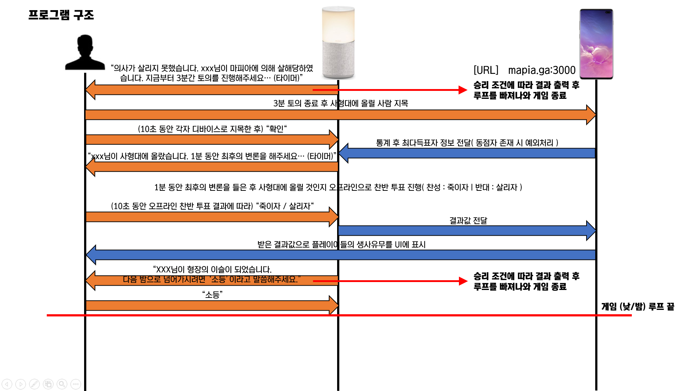

# 마피아 MC

이 NUGU play는 여러명의 사람들과 마피아 게임을 즐기는 사람들을 위해 웹과 연동한 마피아 게임 사회자 대행 서비스를 제공하는 play입니다. 

## Play 제작 의도

마피아 게임은 최근 젊은 층들 사이에서 화제성이 매우 높고 수요가 많은 대표적인 오프라인 게임입니다. 그러나 마피아 게임에서는 한 명의 사회자가 존재하는데 이 사회자는 게임의 모든 룰을 숙지하고 있는 사람이어야하며, 한 판에 오랜시간을 소요하는 게임이기 때문에 진행에 혼선이 만들어지면 안되기 때문에 책임이 막중하고, 무엇보다 정작 본인은 게임에 참여할 수 없다는 점에서 고충이 많습니다. 

> C군(21) : 항상 MT를 가서 마피아 게임을 꼭 친구들과 많이 하는데 그럴 때마다 제가 사회자를 맡곤 했어요. 그것 나름대로 재미가 있긴 하지만 매번 제가 하기에도 그렇고 이런 기능을 대신 수행하는 프로그램이 있었으면 좋겠다고 생각했어요.

> P양(25) : 사회자의 고충을 완전 공감하는데 사회자의 역할 중 모든 게임 참가자들의 역할 배정 및 서로의 정체가 비밀로 보장될 수 있는 장치만 있다면 정말 재밌을 것 같아요.

또한 사람들마다 알고 있는 마피아 세부 룰이 조금씩 다르다는 점에서 표준화된 규칙 제시가 필요합니다. 그리고 심리 추리 게임의 한 종류 이기 때문에 게임 환경 및 상황 설정에 있어서 사람이 조성과 진행을 하는 것보다 컴퓨터가 랜덤으로 설정하고 정해진 규칙에만 따라 진행하는 것이 게임진행에 있어서 더 원활할 수 있습니다.

## Play 진행 구조

## 게임 링크

게임 참여를 위해서는 스피커와 연동되는 Web 링크가 필요하며, 스피커의 안내에 따라 아래 링크를 모두 접속한 상태로 게임을 진행해야 합니다.

http://mapia.ga:3000/ or https://hoy.kr/HiQ6x

